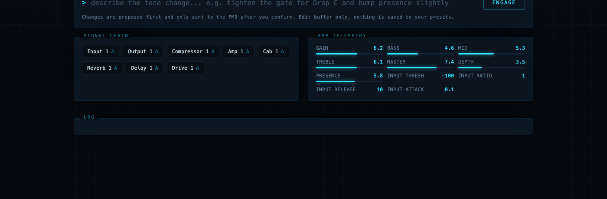
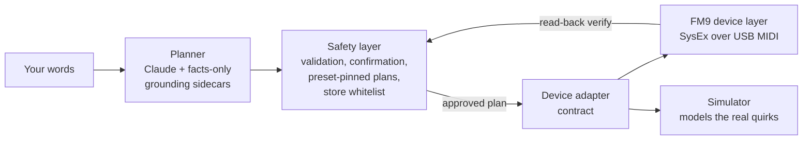

# ToneCommand

**Describe the tone you want. Your rig obeys.**

Natural-language tone control for the Fractal FM9: type "give me a Van Halen
Balance era tone with the flanger on the expression pedal", review the exact
parameter changes it proposes, confirm, and they land on the hardware over
USB MIDI with read-back verification.



*The UI running against the bundled FM9 simulator, which exercises the same
code path as hardware. Changes are proposed first and sent only after you
confirm; the state panels are read back from the device, not assumed.*

## What you can say

Everything below is a real request the planner resolves into concrete,
verified parameter changes (block, channel, ordinal, wire value), shown to
you before anything is sent:

- "give me a Van Halen Balance era tone with the flanger on the expression pedal"
- "a Klon into a JCM800 with a greenback 4x12"
- "tighten the gate for drop C and bump the presence slightly"
- "make scene 1 a dry crunch rhythm and keep the wets in scene 2"
- "put the delay and reverb mix on pedal 2 so I can swell into the chorus"
- "add a subtle octave-down layer like a POG under the lead"

Requests that need facts the project cannot verify get an honest refusal
instead of an invented answer (see Grounding Data below).

## Why this is different

**It knows what the models actually are.** Fractal names like "Brit 800
2204 High" or "1x12 Bludo 906 B" resolve to the real gear they capture:
all 331 amps, all 86 drives, and 2,235 cab IRs are mapped to their
real-world counterparts, every entry cited to community sources, facts
only. Ask for "a Klon into a JCM800 with a greenback 4x12" and it knows
exactly which ordinals you mean. When it doesn't know, it says so.
Nothing is ever invented.

**It tells the truth about hardware.** Every write is verified by
reading the unit back. Presets are stored only to slots you whitelist,
only on explicit confirmation. The bundled simulator models the FM9's
real quirks, including async writes and the operations no hardware
session has verified yet, which it reports by name instead of silently
simulating.

**It was built on a real rig, for real gigs.** This codebase preps
actual setlists: worship sets on Sunday, metal shows with Shieldbearer
whenever the stage calls. Per-song presets voiced from the artists' own
published tone breakdowns, 80s-metal rhythm channels next to ambient
drone scenes, an expression pedal riding every delay. The tooling
exists because the gigs do, and it has to cover everything from
edge-of-breakup cleans to high-gain chug in the same rig.

**It gives back.** Building it meant decoding parts of the FM9 editor
protocol nobody had written down: grid cable encodings, negative
parameter wire format, which reads lie and which don't. It's all
documented below in Protocol Contributions, free for any Fractal tool
builder. The first outside contributor has already mapped the entire cab
catalog and is porting the concept to HeadRush.

## How it works



The planner never touches the wire. It emits a plan in a closed action
vocabulary; the safety layer validates every action against the grounded
catalogs, pins the plan to the preset it was computed for, and requires
your confirmation in the UI. Only then does the device layer transmit,
and every write is verified by reading the unit back. The simulator sits
behind the same adapter contract as the hardware, so the entire test
suite runs without an FM9 attached ([ARCHITECTURE.md](ARCHITECTURE.md)
has the full contract).

The strategy is deliberately FM9-first: make this the safest, most
reliable natural-language control surface for one device before adding
others. The adapter contract exists so future devices inherit the safety
layer instead of reimplementing it, but depth comes before breadth.

## Engineering principles

This project runs on a few non-negotiable rules, and the repository is
the evidence they're followed:

**Claims are verified or labeled.** Every protocol behavior in
[docs/PROTOCOL.md](docs/PROTOCOL.md) was proven by write-plus-readback
on real hardware or is explicitly marked UNDECODED. When we got
something wrong, the correction is public and marked SUPERSEDED - the
ledger keeps our mistakes on the record alongside the fixes, because a
reference you can't audit is not a reference.

**The safety layer is architecture, not policy.** Validation before
send, explicit confirmation, store whitelists, read-back verification,
and simulator honesty live above the device layer
([ARCHITECTURE.md](ARCHITECTURE.md)), so no device port, contributor, or
future feature can accidentally weaken them. New devices inherit safety;
they don't reimplement it.

**Failures become infrastructure.** Every hardware bug this project hit
was converted into a permanent defense: silent write failures became
read-back verification, a severed-cable incident became self-repairing
block insertion, a silently ignored parameter write became a device-layer
fix with a regression test, and the simulator now reproduces each quirk
so the class of bug can't ship twice. The [CHANGELOG](CHANGELOG.md)
records cause alongside fix.

**Contributions are spec-gated and reviewed.** Community PRs land after
assessment-first workflows, CI, and review with file-level findings -
including the one where a contributor proved the maintainers wrong and
the codebase changed to match the hardware. Data contributions carry
citations and drift guards; invented facts are rejected regardless of
how plausible they look.

## Credits & Prior Work

This project would not exist without the Fractal community's protocol work.
The heavy lifting of reverse-engineering the FM9-Edit editor protocol was
done by others; this project builds on it, verifies it against hardware,
and contributes corrections back (see Protocol Contributions below).

- **[mcp-midi-control](https://github.com/TheAndrewStaker/mcp-midi-control)**
  by **Stephen Staker** (TheAndrewStaker), Apache-2.0. The foundation. Its
  `SYSEX-MAP.md` is the best public documentation of the gen-3 Fractal
  editor protocol, byte-verified from hardware captures and binary mining.
  This project's `fm9/protocol.py` is a Python port of its TypeScript
  codec, and `config/fm9_catalog.json` is its FM9 parameter catalog,
  vendored verbatim. Roster data therein derives in part from
  **fractal-syx-codec** by Andrew Mercurio (Apache-2.0), and the grid-read
  cell layout was originally contributed by the **ai-tone-assistant**
  project (MIT).
- **[forgefx-midi](https://github.com/sKuhLight/forgefx-midi)** and
  **[ForgeFX](https://github.com/sKuhLight/ForgeFX)** by **sKuhLight**
  (Apache-2.0 and MIT respectively). Source of the FM9 modifier model:
  slot addressing, the binary-mined field map, and the bind sequence that
  makes expression-pedal assignments possible over MIDI. Re-implemented in
  Python here; ForgeFX was consulted, no code copied.
- **Fractal Audio Systems** publishes the official third-party MIDI spec
  ("Axe-Fx III MIDI for Third-Party Devices", Rev 1.4) that covers the
  documented command set: scenes, bypass, channels, names, tempo, and the
  effect ID table.

Full license reproductions and file-level provenance:
[THIRD_PARTY_NOTICES.md](THIRD_PARTY_NOTICES.md).

## Safety

**Rule zero: this tool can never brick a device.** It touches only
user data, every operation is recoverable by a power cycle and preset
reselect, and the transport layer refuses to send any message type
outside its decoded, verified surface - firmware and bootloader
operations are structurally unreachable, on every device, forever.

Designed so it cannot hurt a rig you care about:

- **Edit-buffer by default.** All changes go to the FM9's volatile working
  buffer, the same place front-panel knob turns go. Re-selecting the preset
  discards everything.
- **Confirm before send.** The natural-language layer only ever proposes a
  plan; nothing is transmitted until you approve it in the UI, and plans
  are pinned to the preset they were computed against (if you switch
  presets on the front panel, the stale plan is refused).
- **Preset numbers are 0-based here.** The MIDI wire numbers the 512 slots
  0-511, while FM9-Edit and the front panel number them 1-512 — so wire 386
  is the preset your editor calls 387. Tools print both. `TONECOMMAND_STORE_SLOTS`
  takes WIRE numbers, so `133-148` designates what the editor shows as 134-149.
- **Store is disabled until YOU enable it.** Persisting to flash refuses
  every slot until you designate disposable ones on your own unit via
  `TONECOMMAND_STORE_SLOTS=133-148` (env var or `.env` line; ranges and
  comma lists accepted). Nobody but you knows what lives in your banks, so
  there is no default. Enforced at the lowest code layer; everything
  outside your configured slots is untouchable.
- **Never touches firmware,** system settings, or global setup.
- **Back up first anyway.** Run a full Fractal-Bot backup before using any
  third-party MIDI tool, this one included.

## Protocol Contributions

Original findings from this project's hardware verification (FM9 firmware
11.00 and 12.00), offered back to the community projects above:

1. **FM9 grid insert requires a cell-select first.** The insert frame
   (fn 0x01 sub 0x32) alone lands the block on the device's internal
   cursor, not the frame's target cell. Sending the cell-select
   (sub 0x30, cell index as a raw uint32 in 5 septets) immediately before
   makes placement honor the target. Upstream documents the FM9 as not
   needing the select; that conclusion came from status-dump verification,
   which can confirm a block exists but not where it landed. Grid-read
   verification exposes the difference.
2. **Grid-read effect IDs alias mod 128.** The sub 0x2E grid bitstream
   stores the block id in 8 bits as (id << 1), so effect ids >= 128 wrap:
   FX Send (182) reads as 54, FX Return (186) reads as 58. Disambiguate
   against the fn 0x13 status dump.
3. **FM9 modifier source ordinal 11 = Pedal 2 (EXP/SW TIP),** confirmed
   physically. Upstream marks the FM9 source enum as uncaptured with an
   explicit warning against assuming the FM3's values; at least around the
   pedal entries, the FM3 ordering holds on the FM9.
4. **Documented dead ends** so nobody re-burns time on them: the sub 09 00
   GET always returns a zeroed value field on fw 11.00 (use the fn 0x1F
   bulk read instead); the sub 0x1F display-name query returns "NONE" for
   modifier source enums, and for the amp block it returns the roster's
   FIRST entry regardless of the actual amp type - before and after
   writes, through seconds of settle (proven on fw 12.00 by
   @bschmalz81401, reproduced on fw 11.00; this project's earlier "fresh
   for amp" claim was wrong). Never verify a type through it; read the
   wire value and map through the roster. Live modulation (a moving
   pedal) is invisible to every known read, so pedal bindings must be
   verified physically.
5. **Cable drawing hardware-validated.** The community's 6-row cable
   encoding formula (fn 0x01 sub 0x35), previously byte-derived from
   captures but unverified as a live write, draws correct cables on FM9
   firmware 11.00: all masks confirmed by grid read-back. Also verified:
   placing an already-placed block at a new cell is ignored (a "move" is
   clear-then-insert, and clearing a cell destroys its cables).
6. **Shunt-replacement insertion.** Placing a block onto an existing shunt
   cell inherits the shunt's cables, which makes it possible to add effects
   into a preset's signal chain without touching the only partially decoded
   cable-drawing encoding at all.
7. **Same-row cable draws on row 2 use their own encoding.** The general
   6-row formula silently draws nothing for a row-2-to-row-2 connection.
   Probed on hardware (fw 11.00): odd source columns need dest_sign 0 with
   b23 3, even columns dest_sign 1 with b23 1. The general formula's
   prediction for those byte values collides with a different geometry, so
   the same bytes mean different things than it assumes. Row 5 same-row
   draws match the general formula. Also observed: a 2-row diagonal draw
   does not register at all, and re-sending an identical draw does NOT
   remove the cable (removal is a different, still-unknown message).
8. **Writes are asynchronous; unsettled reads lie plausibly.** A read
   issued immediately after a write returns the pre-write state with no
   error indication. The bundled simulator now models this (an 80ms settle
   window) and additionally tracks "undecoded territory": operations no
   hardware session has verified are reported by name rather than
   silently simulated.
9. **Empty preset slots identify themselves, and leave a ghost.** The FM9
   writes its own marker, `<EMPTY>`, into an unused slot's name field - so
   detecting a free slot needs no heuristic. Clearing a slot overwrites
   only the FIRST 8 BYTES of the 32-byte name field and leaves the rest of
   the previous name in flash, so name fields must be cut at the first NUL
   rather than right-stripped. Right-stripping yields the marker glued to
   the tail of a preset that no longer exists (`'<EMPTY>\0 Phat Time'`).
   Verified across all 512 slots on fw 12.00.
10. **fn 0x0D reads any slot by number, out of flash, without loading it.**
    Passing a preset number instead of the "current" sentinel answers from
    storage and leaves the loaded preset and the edit buffer untouched, with
    the requested number echoed back. A 512-slot sweep was byte-identical to
    a select-and-read sweep of the same unit and took 4.7s instead of ~4.5
    minutes, with the front panel never moving. Confirmed on fw 11.00 and
    12.00. Out-of-range numbers are ANSWERED rather than refused - preset
    512 returns a blank name field - and a blank is not the `<EMPTY>`
    marker, so unguarded readers call a nonexistent slot occupied.
11. **A preset can be built from nothing.** An empty slot has NO grid cells
    at all and no Input or Output blocks - its status dump carries only the
    ever-present ids 200 and 201 - so there is nothing to splice into and no
    cable to inherit. Placing blocks into that blank grid works, Input and
    Output included, each arriving uncabled. Same-row cable draws on row 3
    then work with the general 6-row formula (previously only rows 4 and 5
    were confirmed; row 2 needs its own encoding, item 7). Verified on
    fw 12.00 by building Input -> amp -> cab -> Output across columns 1-4
    and confirming the result audible by ear.

## Grounding Data

The planner grounds Fractal's model names in the real-world gear they
model, so "give me a Klon into a JCM800 with a greenback 4x12" resolves
to actual ordinals instead of guesses:

| Domain | Coverage | Source |
|---|---|---|
| Amp models | 331 / 331 | Yek's Amp Guide (community PDF, facts only) |
| Drive models | 86 / 86 | Yek's Drive Guide + Fractal wiki Drive block page |
| Cab IRs | 2,235 / 2,237 | Fractal wiki Cab models page (via @bschmalz81401) |
| DynaCabs | 45 / 45 | same |

All sidecars are facts-only (no prose reproduced), carry the Fractal
name they were built against, and fail loudly if a catalog update
renumbers the rosters. Unknowns stay unknown: nothing is invented.

## Compatibility

Verified means proven by write-plus-readback on real hardware in this
project's regression runs; nothing below is assumed.

| Capability | FM9 fw 11.00 | FM9 fw 12.00 | Simulator |
|---|---|---|---|
| Scene, bypass, channel control | Verified | Verified (contributor) | Modeled |
| Parameter set with read-back verify | Verified | Verified (contributor) | Modeled |
| Expression pedal (modifier) binding | Verified | Untested | Modeled |
| Block insert and cable drawing | Verified | Verified (contributor) | Modeled, incl. known encoding quirks |
| Store to whitelisted slots | Verified | Untested | Modeled |
| Tone library harvest (all 512 slots) | Verified | Untested | Modeled |
| Slot name read by number, no select | Verified | Verified (contributor) | Modeled |
| Empty-slot detection (`<EMPTY>` marker) | Untested | Verified (contributor) | Modeled |
| Preset built from scratch in an empty slot | Untested | Verified (contributor) | Modeled |

Hardware: developed and regression-tested on an FM9 Mk II Turbo. Other
FM9 variants share the model byte and should behave identically, but are
untested. Axe-Fx III and FM3 use different model bytes and are not
supported. Firmware outside 11.x / 12.00 is untested; the editor
protocol is unofficial and firmware-sensitive, and the hardware
regression suite passing is the green light after any update. The
original protocol feasibility findings, with the exact commands and
responses observed, are written up in
[docs/HARDWARE-VALIDATION.md](docs/HARDWARE-VALIDATION.md).

## Disclaimer

Not affiliated with or endorsed by Fractal Audio Systems. Uses
reverse-engineered protocol; may break with firmware updates. Back up your
presets. Use at your own risk.

## Install / Setup

Tested on macOS (Apple Silicon) with Python 3.12 and an FM9 connected over
USB, on firmware 11.00 and 12.00.

```bash
git clone https://github.com/monzta1/ToneCommand.git
cd ToneCommand
python3 -m venv .venv
.venv/bin/pip install -e .
```

Dependencies are declared in [pyproject.toml](pyproject.toml); add
`".[dev]"` to also get the test tooling.

Natural-language planning uses, in order of preference:
1. The Claude Code CLI, if installed and signed in (usage bills to your
   existing Claude subscription), or
2. The Claude API: put `ANTHROPIC_API_KEY=sk-ant-...` in a `.env` file at
   the repo root.

Run:

```bash
.venv/bin/tonecommand
# open http://127.0.0.1:8909 with the FM9 connected and powered on
```

Testing is two-tier:

```bash
.venv/bin/pytest tests/                    # simulator + validation suite, no hardware needed (runs in CI on every push)
.venv/bin/python hardware_regression.py    # 13-check on-hardware regression; run after any firmware update
.venv/bin/python build_133.py              # example: scripted full preset build (stores to wire slot 133 = FM9-Edit 134)
```

Notes:
- Do not run FM9-Edit and this tool at the same time; FM9-Edit resets the
  edit buffer when it connects. Stored presets are safe and remain fully
  viewable/editable in FM9-Edit afterwards.
- Firmware and hardware coverage is spelled out in the Compatibility
  section above; run `hardware_regression.py` after any firmware update
  before trusting writes.

## Community

ToneCommand has a Slack:
**[join here](https://join.slack.com/t/tonecommand/shared_invite/zt-47oosli5y-GMHa93bbD4Qf76X4s1Crfg)**.
Protocol decodes land in #protocol-decodes with their evidence, the
HeadRush port lives in #headrush, and #show-and-tell is for what your
rig did on stage. If you're building on the protocol findings, porting
to another device, or just got a tone you're proud of, come say hi.

## Support

ToneCommand is free and always will be. If it saved you an evening of
preset fiddling, you can [buy the maintainer a coffee](https://buymeacoffee.com/shieldbearer)
under his stage name, Shieldbearer - the same rig this tool preps for
real gigs.

## License

Apache License 2.0 for this project's code. Vendored and derived content
carries its own upstream copyrights; see
[THIRD_PARTY_NOTICES.md](THIRD_PARTY_NOTICES.md).
